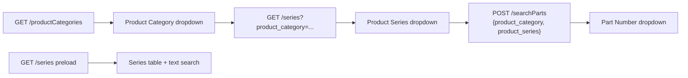

# OPM UI — API Documentation

> This document describes the GC Match HTTP APIs used by the OPM demo UI. Source of truth: `opm-api-client.js` and page-level JS files.

**Last updated:** 2026-05-21  
**Related files:** `opm-api-client.js` · `opm-config.js` · `opm-data-store.js` · `opm-series-coverage.js` · `opm-saved-drafts.js` · `opm-opm.js`

---

## Table of Contents

1. [Overview](#overview)
2. [Configuration & Authentication](#configuration--authentication)
3. [API Services](#api-services)
4. [Endpoint Catalog](#endpoint-catalog)
5. [Series Coverage: Category → Series → Part](#series-coverage-category--series--part)
6. [Search History (Saved Drafts)](#search-history-saved-drafts)
7. [OPM: AI Recommendations](#opm-ai-recommendations)
8. [recommend_from_ticket vs searchParts](#recommend_from_ticket-vs-searchparts)
9. [Defined but Not Wired to UI](#defined-but-not-wired-to-ui)
10. [Error Handling](#error-handling)
11. [Page-to-API Mapping](#page-to-api-mapping)
12. [Client Reference](#client-reference)
13. [Live Test Notes](#live-test-notes)

---

## Overview

This project is a static HTML/JS application. All HTTP requests go through `OpmApiClient` (`opm-api-client.js`) using the browser `fetch` API.

| Service | Config key | Default | Role |
|---------|------------|---------|------|
| **GC Match API** (Azure) | `GCMATCH_API_BASE_URL` | `https://con-gcmatch.blueplant-16804982.westus2.azurecontainerapps.io` | Primary — categories, series, parts, OPM recommendations |
| OPM local API | `API_BASE_URL` | `http://localhost:3050` | Fallback — defined in client, not used by current UI flows |

### Capability Map

| User capability | API(s) | Page |
|-----------------|--------|------|
| Browse product category / series / part | `GET /productCategories`, `GET /series?product_category=`, `POST /searchParts` (category + series) | Series Coverage |
| Search & list series | `GET /series` (preload) + local filter | Series Coverage |
| Filter OPM search history by Requested part number (local, no API) | `localStorage` via `OpmRecentQueries` | Search History (Saved Drafts) |
| AI Top-N OPM recommendations | `POST /recommend_from_ticket` | OPM |

---

## Configuration & Authentication

Configuration file: `opm-config.js` (copy from `opm-config.example.js`)

```javascript
window.OPM_CONFIG = {
  API_BASE_URL: "http://localhost:3050",
  GCMATCH_API_BASE_URL: "https://con-gcmatch.blueplant-16804982.westus2.azurecontainerapps.io",
  TOP_N: 3,                        // Default top_n for recommend_from_ticket
  API_KEY: "",                     // Optional; sent as x-api-key when set
  USE_MOCK_WHEN_UNAVAILABLE: true, // Mock series data if preload fails
};
```

### Common Request Headers

| Header | Value | Notes |
|--------|-------|-------|
| `Accept` | `application/json` | All requests |
| `Content-Type` | `application/json` | POST requests |
| `x-api-key` | `{API_KEY}` | Only when `API_KEY` is non-empty |

### Client Response Wrapper

Every `OpmApiClient` method returns:

```javascript
{
  ok: boolean,      // response.ok
  status: number,   // HTTP status
  data: object|null // Parsed JSON, or { raw: string }
}
```

---

## API Services

### GC Match API (Primary)

Deployed on Azure Container Apps. All active UI features use this base URL.

**Base URL:** `{GCMATCH_API_BASE_URL}`

### OPM API (Local / Fallback)

Legacy/local endpoints. Methods exist in `opm-api-client.js` but are **not** called by current pages.

**Base URL:** `{API_BASE_URL}`

---

## Endpoint Catalog

| # | Method | Path | Client method | UI status |
|---|--------|------|---------------|-----------|
| 1 | GET | `/productCategories` | `getProductCategories()` | Active — Series Coverage filters |
| 2 | GET | `/series` | `getGcmatchSeries()` | Active — Series Coverage preload + search |
| 3 | GET | `/series?product_category={name}` | `getGcmatchSeriesByCategory(category)` | Active — Series Coverage filters |
| 4 | POST | `/searchParts` | `searchParts(payload)` | Active — Series Coverage (parts); not used on Search History |
| 5 | POST | `/recommend_from_ticket` | `recommendFromTicket(text, topN)` | Active — OPM page |
| 6 | GET | `/series` | `getSeries()` | Defined, unused (OPM API base) |
| 7 | POST | `/savedDrafts` | `getSavedDrafts(search)` | Defined, unused |

---

## Series Coverage: Category → Series → Part

Three cascading dropdowns under the **Search Series** input. Data is loaded on demand with in-page caches (`seriesCacheByCategory`, `partsCacheByKey`).



### 1. Get Product Categories

| Property | Value |
|----------|-------|
| **Method** | `GET` |
| **Path** | `/productCategories` |
| **Client** | `OpmApiClient.getProductCategories()` |
| **Trigger** | Series Coverage page load |

#### Response Example

```json
{
  "total": 37,
  "Categories": [
    { "Categories": "pressure transducer" },
    { "Categories": "level device" },
    { "Categories": "flow device" }
  ]
}
```

Use the exact string from `Categories` (e.g. `pressure transducer`) as `product_category` in later calls.

---

### 2. Get Series List (All)

| Property | Value |
|----------|-------|
| **Method** | `GET` |
| **Path** | `/series` |
| **Client** | `OpmApiClient.getGcmatchSeries()` |
| **Trigger** | Preloaded via `OpmDataStore.loadSeries()` on page load |

#### Response Example

```json
[
  {
    "series_name": "267",
    "obsolete_status": "active",
    "product_category": "pressure transducer"
  }
]
```

#### Frontend Usage

- Powers the **Product Series** dropdown only (table uses part-level data from `searchParts`)
- Text filter on the search input
- CSV download
- Fallback mock when `USE_MOCK_WHEN_UNAVAILABLE` and preload fails

---

### 3. Get Series by Product Category

| Property | Value |
|----------|-------|
| **Method** | `GET` |
| **Path** | `/series?product_category={url-encoded category}` |
| **Client** | `OpmApiClient.getGcmatchSeriesByCategory(productCategory)` |
| **Trigger** | User selects **Product Category** |

#### Example Request

```
GET /series?product_category=pressure%20transducer
```

#### Response

Same array shape as [Get Series List (All)](#2-get-series-list-all), filtered to one category.

#### Frontend Usage

- Fills **Product Series** dropdown
- When category is selected, table search uses this subset instead of the full preload list

---

### 4. Search Parts (By Category + Series)

| Property | Value |
|----------|-------|
| **Method** | `POST` |
| **Path** | `/searchParts` |
| **Client** | `OpmApiClient.searchParts({ product_category, product_series })` |
| **Trigger** | User selects **Product Series** |

#### Request Body

```json
{
  "product_category": "pressure transducer",
  "product_series": "200"
}
```

#### Response Example

```json
{
  "total": 200,
  "parts": [
    {
      "part_number": "2001000012101orf",
      "product_category": "pressure transducer",
      "product_series": "200",
      "obsolete_status": "active",
      "recommended_replacement": null,
      "brand": "NOSHOK",
      "datasheet_pdf": "https://...",
      "specifications": { }
    }
  ]
}
```

#### Frontend Usage

- Fills **Part Number** dropdown (`parts[].part_number`)
- Powers the **Part Number / Status** table (`parts[].part_number`, `parts[].obsolete_status`)
- Large payloads (~200 parts); response is cached per `category::series` (slim: part number + status)
- Optional part filter narrows the table to one row

---

## Search History (Saved Drafts)

All table data comes from **all** OPM **Get Recommendation** runs in `localStorage` (`opm_recent_ticket_queries`), via `OpmRecentQueries.getRecentHistoryRows()`. The table paginates **10 rows per page**. **Recent searches from OPM** badges show the **10** newest searches. **Search does not call the API.**

| Column | Source |
|--------|--------|
| **Requested** | History part number |
| **Recommended** | Each stored `recommendations[].recommended_part_number` (one row per recommendation) |

### Default table

On load (or empty search input), the page shows the full history table.

### Filter by part number (client-side)

| Property | Value |
|----------|-------|
| **Trigger** | User enters text and clicks **Search**, or clicks a **Recent searches from OPM** badge |
| **Logic** | Case-insensitive substring match on **Requested** (`row.requested.includes(query)`) |
| **Example** | History includes `209120cpg2m24p1`; query `2091` shows all rows whose Requested contains `2091` |
| **Clear filter** | Submit with empty input → show full history again |

No matches → message: *No search history entries match your filter.*

---

## OPM: AI Recommendations

The OPM page **already uses** `POST /recommend_from_ticket`. There is no separate “new” recommendation API in the UI.

| Property | Value |
|----------|-------|
| **Method** | `POST` |
| **Path** | `/recommend_from_ticket` |
| **Client** | `OpmApiClient.recommendFromTicket(queryText, topN)` |
| **Trigger** | User submits **Get Recommendation** |
| **Page** | `index.html` |

#### Request Body

```json
{
  "ticket_text": "Need replacement for 20010001497ORF",
  "top_n": 3
}
```

| Field | Type | Required | Description |
|-------|------|----------|-------------|
| `ticket_text` | string | Yes | Part number or replacement request text (trimmed). Backend field name is `ticket_text`; UI copy does not refer to “tickets”. |
| `top_n` | number | No | Number of recommendations; default `OPM_CONFIG.TOP_N` (3) |

#### Success Response (Abbreviated)

```json
{
  "requested_part_number": "20010001497ORF",
  "datasheet_pdf_requested": "https://...",
  "recommendations": [
    {
      "recommended_part_number": "2061100BGJ728H18NN",
      "recommended_series": "206",
      "confidence_score": 100.0,
      "datasheet_pdf_recommended": "https://...",
      "draft_email": "Dear Customer,...",
      "comparison_table": {
        "requested_part": { "Part Number": "...", "Series": "..." },
        "recommended_part": { "Part Number": "...", "Series": "..." }
      }
    }
  ]
}
```

#### UI Behavior

- Recommendation cards with confidence scores
- Specification comparison table (top 10 → Show more → Show all → Collapse)
- **Draft Email** from `draft_email`
- Datasheet PDF links

#### Special Response (HTTP 200)

```json
{
  "message": "Ticket not related to OPM"
}
```

UI maps this to a friendly warning (backend message string is unchanged).

#### Performance

Typically **1–2 minutes** per request; loading UI shows elapsed time.

#### Side Effect

On success, `OpmRecentQueries.add(queryText, { response })` appends to full search history in `localStorage`; Search History shows the **10** newest searches as badges and paginates the full table at **10** rows per page.

---

## recommend_from_ticket vs searchParts

Both are GC Match endpoints but serve **different product flows**. The OPM page does **not** need a new API — it already calls `recommend_from_ticket`.

| | `POST /recommend_from_ticket` | `POST /searchParts` |
|--|-------------------------------|---------------------|
| **Purpose** | AI OPM replacement recommendations (Top N) | Catalog / database part lookup |
| **Input** | Free text (`ticket_text`) | `part_number` **or** `product_category` + `product_series` |
| **Output** | Multiple recommendations, spec comparison, draft email, PDFs | Part list or single replacement fields |
| **Typical latency** | ~60–120s | ~2–30s (category+series can be ~24s, large body) |
| **Intelligence** | NLP / similarity matching | Exact or rule-based lookup |
| **Used on** | OPM page | Series Coverage (parts dropdown) |
| **Best for** | “Need replacement for …” natural language | Known part number or browsing a series |

**Important:** A part that works in `recommend_from_ticket` (e.g. `20010001497ORF`) may return **404** on `searchParts` if it is not indexed for direct lookup.

---

## Defined but Not Wired to UI

### Get Series List (OPM API)

| Method | `GET` `/series` on `{API_BASE_URL}` |
| Client | `getSeries()` |
| Status | Unused; GC Match `getGcmatchSeries()` is used instead |

### Get Saved Drafts List

| Method | `POST` `/savedDrafts` on `{API_BASE_URL}` |
| Client | `getSavedDrafts(search)` |
| Status | Unused; Search History uses localStorage only |

---

## Error Handling

### `OpmApiClient.formatApiError(res)`

Used on the OPM page:

| Condition | Message |
|-----------|---------|
| `detail` contains “no part or series found” / “no parts found” | Friendly not-found text with example input |
| HTTP ≥ 500 | `Server error (HTTP {status}): {detail}` |
| Other `detail` / `message` / `error` | Shown as-is |
| No detail | `Request failed (HTTP {status}).` |

### Network Errors

| Page | Message |
|------|---------|
| OPM | Check `GCMATCH_API_BASE_URL` and CORS |
| Search History | Run a search on OPM first; data is in `localStorage` (`opm_recent_ticket_queries`) |

---

## Page-to-API Mapping

| Page | HTML | JS | Preload | On-demand |
|------|------|-----|---------|-----------|
| **OPM** | `index.html` | `opm-opm.js` | — | `POST /recommend_from_ticket` |
| **Search History** | `opm-saved-drafts.html` | `opm-saved-drafts.js` | — | Client filter on `localStorage` history (no API on Search) |
| **Series Coverage** | `opm-series-coverage.html` | `opm-series-coverage.js` | `GET /series` | `GET /productCategories`; `GET /series?product_category=`; `POST /searchParts` (category + series) |

### Data Flow

```
opm-config.js
    ↓
opm-api-client.js  →  fetch()
    ↓
opm-data-store.js  →  preload GET /series (Series Coverage only)
opm-page-bootstrap.js
    ↓
Page JS  →  filters, search, tables
```

### Cache & Events (Data Store)

| Key | Source | Events |
|-----|--------|--------|
| `series` | `GET /series` or mock | `opm:cache-updated`, `opm:data-ready` |

Series Coverage additionally caches categories/series/parts in `opm-series-coverage.js` (not in `OpmDataStore`).

```javascript
OpmDataStore.snapshot()  // debug preload cache
```

---

## Client Reference

```javascript
// Series Coverage — filters
const cats = await OpmApiClient.getProductCategories();
const series = await OpmApiClient.getGcmatchSeriesByCategory("pressure transducer");
const parts = await OpmApiClient.searchParts({
  product_category: "pressure transducer",
  product_series: "200",
});

// Series Coverage — table preload (automatic)
await OpmDataStore.preloadForCurrentPage();

// Search History — filter is client-side only (OpmRecentQueries.getRecentHistoryRows)

// OPM — AI recommendations (same as backend spec)
const rec = await OpmApiClient.recommendFromTicket(
  "Need replacement for 20010001497ORF",
  3
);

if (!rec.ok) alert(OpmApiClient.formatApiError(rec));
```

### Method Quick Reference

| Method | HTTP | Path | Base |
|--------|------|------|------|
| `getProductCategories()` | GET | `/productCategories` | GCMATCH |
| `getGcmatchSeries()` | GET | `/series` | GCMATCH |
| `getGcmatchSeriesByCategory(cat)` | GET | `/series?product_category=` | GCMATCH |
| `searchParts(string)` | POST | `/searchParts` | GCMATCH |
| `searchParts({ product_category, product_series })` | POST | `/searchParts` | GCMATCH |
| `recommendFromTicket(text, topN)` | POST | `/recommend_from_ticket` | GCMATCH |
| `getSeries()` | GET | `/series` | OPM (unused) |
| `getSavedDrafts(search)` | POST | `/savedDrafts` | OPM (unused) |

---

## Live Test Notes

Tested against production GC Match (2026-05-21). Latency varies with load.

| Endpoint | HTTP | Approx. time | Notes |
|----------|------|--------------|-------|
| `GET /productCategories` | 200 | ~27s | 37 categories |
| `GET /series?product_category=pressure transducer` | 200 | ~97s | 110+ series |
| `GET /series` (no filter) | 200 | ~76s | Full catalog, large |
| `POST /searchParts` (category + series) | 200 | ~24s | `total: 200`, ~1.3MB body |
| `POST /searchParts` (`20010001497ORF`) | 404 | ~2s | `No parts found` |
| `POST /recommend_from_ticket` | 200 | ~65s | 3 recommendations for demo text |

**Demo part for OPM:** `Need replacement for 20010001497ORF`

---

## Frontend Performance Optimizations

Implemented in `opm-api-cache.js`, `opm-api-client.js`, and page JS (2026-05-21).

| Technique | Where | Effect |
|-----------|-------|--------|
| **No full `GET /series` preload** | Series Coverage | Avoids ~60–90s blocking load on page open |
| **localStorage cache + 24h TTL** | Categories, series per category, part number lists | Repeat visits open dropdowns instantly |
| **Stale-while-revalidate** | Series Coverage filters | Show cache first, refresh in background |
| **Slim part cache** | Part dropdown + table | Stores `part_number` and `obsolete_status`, not full `specifications` |
| **Part dropdown cap** | `PARTS_DROPDOWN_LIMIT` (150) | Avoids rendering 200+ `<option>` elements |
| **Request timeouts** | `API_TIMEOUT_MS` (45s), browse parts (90s), recommend (180s) | Fails fast with clear message instead of hanging |
| **Part-based table** | Search requires category + series | Table uses `POST /searchParts` parts for the selected series |

Config (`opm-config.js`):

```javascript
API_TIMEOUT_MS: 45000,
API_TIMEOUT_RECOMMEND_MS: 180000,
CACHE_TTL_MS: 86400000,
PARTS_DROPDOWN_LIMIT: 150,
```

Clear cache in browser console: remove keys prefixed with `opm_gcmatch_` in Application → Local Storage.

---

## Appendix: Mock Data

When `USE_MOCK_WHEN_UNAVAILABLE !== false` and series preload fails:

```json
[
  { "series_name": "267", "obsolete_status": "Active" },
  { "series_name": "3100", "obsolete_status": "Active" },
  { "series_name": "LS-7", "obsolete_status": "Obsolete" }
]
```

---

*Keep this document aligned with `opm-api-client.js` and page JS. Backend field names such as `ticket_text` are API contracts; UI labels may use “search text” or “part number” instead.*
